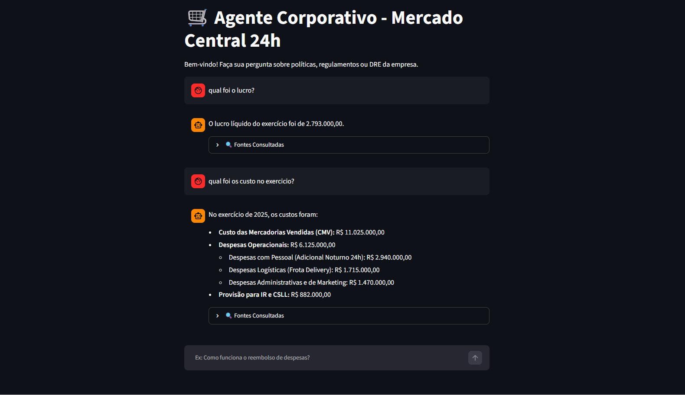

# 🛒 Agente Inteligente - Mercado Central 24h

Este projeto consiste em um assistente virtual corporativo baseado em Inteligência Artificial (RAG - Retrieval-Augmented Generation). O agente é capaz de responder dúvidas de funcionários e gestores com base em documentos internos da empresa (manuais, FAQs, políticas de atendimento e balanços financeiros), garantindo respostas precisas e sem alucinações.

A aplicação está disponível publicamente na nuvem, hospedada em uma instância da **Oracle Cloud Infrastructure (OCI)**.

---

## 📸 Sistema em Funcionamento

Abaixo está a interface web do agente rodando localmente e integrada ao modelo de linguagem:



---

## 🏗️ Arquitetura da Solução

O sistema segue o padrão RAG (Retrieval-Augmented Generation), combinando busca semântica em uma base de conhecimento local com geração de texto por um modelo de linguagem:

```
PDFs (documentos_base/)
        │
        ▼
processador_pdf.py  →  leitura e fatiamento (chunking) dos documentos
        │
        ▼
indexador.py  →  geração de embeddings multilíngues e persistência no ChromaDB
        │
        ▼
chroma_db/  →  banco vetorial local
        │
        ▼
agente.py  →  retriever (MMR) + prompt + LLM (Gemini 2.5 Flash) via LangChain
        │
        ▼
app.py  →  interface de chat (Streamlit)
        │
        ▼
Docker  →  empacotamento da aplicação
        │
        ▼
OCI (Oracle Cloud Infrastructure)  →  hospedagem pública
```

Quando o usuário faz uma pergunta, o `retriever` busca no banco vetorial os trechos mais relevantes dos documentos (usando MMR para equilibrar relevância e diversidade das fontes), monta o contexto e envia tudo ao modelo Gemini, que responde **exclusivamente** com base nesse contexto — evitando respostas inventadas.

---

## 🛠️ Tecnologias e Ferramentas Utilizadas

- **Python** — linguagem principal do projeto
- **LangChain** — orquestração da cadeia RAG (LCEL)
- **ChromaDB** — banco de dados vetorial local
- **HuggingFace Embeddings** (`paraphrase-multilingual-mpnet-base-v2`) — geração de embeddings multilíngues, com bom suporte a português
- **Google Gemini 2.5 Flash** (via `langchain-google-genai`) — modelo de linguagem (LLM)
- **Streamlit** — interface web de chat
- **Docker** — containerização da aplicação
- **Oracle Cloud Infrastructure (OCI)** — hospedagem em nuvem

---

## 📂 O Que Foi Criado (Estrutura do Projeto)

O projeto foi estruturado em módulos para separar a ingestão de dados, o processamento de IA e a interface de usuário:

* **`processador_pdf.py`**: Responsável por ler os documentos em PDF da pasta base, fatiá-los em pedaços menores (*chunks*) e prepará-los para a vetorização.
* **`indexador.py`**: Converte os textos fatiados em vetores matemáticos usando embeddings e os armazena no banco de dados vetorial local.
* **`agente.py`**: Contém o motor principal do agente, configurando a busca semântica avançada (com MMR para diversidade de fontes), o *prompt* do sistema e a conexão com o modelo **Google Gemini (Gemini 2.5 Flash)** via LangChain.
* **`app.py`**: Constrói a interface de chat interativa e amigável utilizando **Streamlit**.
* **`conversor_md_pdf.py`**: Utilitário de conversão entre arquivos Markdown e PDF.
* **`list_models.py`**: Script auxiliar para listar os modelos disponíveis na chave de API do Google.
* **`requirements.txt`**: Lista com todas as bibliotecas Python necessárias para rodar o projeto (LangChain, ChromaDB, Streamlit, etc.).
* **`Dockerfile` & `.dockerignore`**: Arquivos de configuração para empacotar toda a aplicação em um container isolado.
* **`.env`**: Arquivo seguro para armazenar variáveis de ambiente, como a chave de API do Google (não versionado no Git).

---

## 🚀 Como Executar o Projeto Localmente

### 1. Clonar o repositório

```bash
git clone https://github.com/nayanpereira/agente-RAG.git
cd agente-RAG
```

### 2. Criar e Ativar o Ambiente Virtual (venv)

É altamente recomendável isolar as dependências do projeto usando um ambiente virtual:

**No Windows (CMD ou PowerShell):**

```bash
python -m venv venv
venv\Scripts\activate
```

**No Linux / macOS:**

```bash
python3 -m venv venv
source venv/bin/activate
```

### 3. Instalar as Dependências

Com o ambiente virtual ativado, instale todas as bibliotecas necessárias listadas no projeto:

```bash
pip install -r requirements.txt
```

### 4. Configurar as Variáveis de Ambiente (.env)

Na raiz do projeto, crie um arquivo chamado `.env` e adicione a sua chave da API do Google:

```
GOOGLE_API_KEY=sua_chave_aqui_sem_aspas
```

### 5. Indexar a Base de Conhecimento

Certifique-se de que a pasta contendo os seus arquivos PDF (documentos base) está configurada no projeto. Em seguida, execute o script de indexação para gerar o banco vetorial local:

```bash
python indexador.py
```

### 6. Iniciar a Aplicação Web

Com o banco vetorial pronto, inicie o servidor local do Streamlit:

```bash
streamlit run app.py
```

O navegador abrirá automaticamente a interface do chat em: `http://localhost:8501`

---

## 🐳 Containerização com Docker

Se preferir rodar a aplicação isolada em um container (sem precisar gerenciar versões do Python na máquina local):

**1. Construir a imagem Docker:**

```bash
docker build -t agente-mercado-central .
```

**2. Executar o container (injetando o arquivo `.env` para segurança):**

```bash
docker run -p 8501:8501 --env-file .env agente-mercado-central
```

Acesse a aplicação no navegador em: `http://localhost:8501`

---

## ☁️ Deploy em Nuvem (Oracle Cloud Infrastructure)

A aplicação foi disponibilizada publicamente na web utilizando a **Oracle Cloud Infrastructure (OCI)**. O fluxo de deploy seguido foi:

### 1. Enviar a Imagem para o Docker Hub

```bash
docker login
docker tag agente-mercado-central seu_usuario_dockerhub/agente-mercado-central:latest
docker push seu_usuario_dockerhub/agente-mercado-central:latest
```

### 2. Provisionar a Máquina Virtual (Compute Instance)

- Instância Linux (Ubuntu) criada no painel da OCI.
- IP público anotado para acesso externo.

### 3. Liberar a Porta de Rede

- Configurada uma regra de entrada (Ingress Rule) na Security List da OCI, permitindo conexões TCP na porta `8501` para `0.0.0.0/0`.

### 4. Rodar a Aplicação na Nuvem via SSH

Conexão via SSH na instância, instalação do Docker:

```bash
sudo apt update && sudo apt install -y docker.io
```

Criação do `.env` no servidor:

```bash
nano .env
# Cole: GOOGLE_API_KEY=sua_chave_aqui (salve e feche o arquivo)
```

Execução do container em segundo plano:

```bash
docker run -d -p 8501:8501 --env-file .env seu_usuario_dockerhub/agente-mercado-central:latest
```

A aplicação fica então acessível publicamente em: `http://<IP_PUBLICO_DA_INSTANCIA>:8501`

---

## 💬 Exemplos de Perguntas que o Agente Consegue Responder

- "Como funciona o pagamento de horas extras em feriados?"
- "Qual foi o lucro líquido do exercício?"
- "Qual é a política de trocas e devoluções da loja?"
- "Quais são os procedimentos operacionais padrão (SOP) da empresa?"
- "Quais critérios os fornecedores precisam atender para fazer parceria com o Mercado Central 24h?"

---

## 🖥️ Exemplos de Respostas Geradas pelo Agente

**Pergunta:** Como funciona o pagamento de horas extras em feriados?

**Resposta:** O trabalho em feriados é remunerado com acréscimo de 100% sobre o valor da hora normal, além do dia normal já pago no salário mensal. Alternativamente, o colaborador pode optar por compensar o feriado trabalhado com um dia de folga em outra data, mediante acordo prévio com o gestor direto. Essa opção é registrada no sistema de ponto para fins de auditoria.

Conforme as escalas de feriado, o colaborador que trabalha no feriado tem direito a uma folga compensatória ou pagamento em dobro, conforme a escala definida pelo gerente.

**Pergunta:** Qual foi o lucro líquido do exercício?

**Resposta:** O lucro líquido do exercício foi de 2.793.000,00.

Em ambos os casos, o agente cita as fontes consultadas (nome do PDF e número da página), garantindo rastreabilidade da informação. Quando a resposta não está presente nos documentos, o agente informa diretamente que não encontrou a informação, em vez de inventar uma resposta.